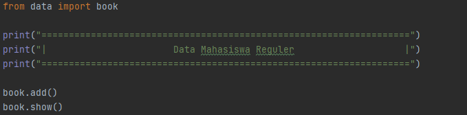

# Lab-6
Repository ini dibuat untuk memenuhi tugas di pertemuan-10  
<pre>
Nama    : Pikri Ramdani 
Kelas   : TI.20.A1
NIM     : 312010162
Dosen   : Agung Nugroho S.Kom, M.Kom
</pre>
***

**Berikut ini tugas yang diberikan oleh dosen saya :**  

Untuk membuat task diatas saya dengan source code sebagai berikut:  
**Data** & **Main Script**
 
 
**Untuk membuat file **Data** tersebut saya menggunakan source code dibawah ini :**  

  

Kemudian kita *save* di folder sendiri, disini saya menyimpan file **Data** kedalam folder **Data** dan saya simpan dengan file name *book*.  

Source Code diatas berfungi sebagai berbagai *action syntax* yang nanti akan di run di file **Main Script**.
 
**Kemudian untuk file **Main Script** nya sendiri saya menggunakan source code sebagai berikut :**

**Kemudian setelah 2 file tersebut dibuat, lalu kita run. Maka akan menghasilkan output sebagai berikut:**

**Dan disitu kita punya 6 opsi:**  

**Lihat**  
**Tambah**  
**Hapus**  
**Ubah**  
**Cari**  
**Keluar**  

Mari kita coba opsi T (Tambah) dari source code **Book** diatas, maka output yang keluar adalah sebagai berikut :  

Berjalan sesuai dengan yang kita inginkan.  
 

**Sekarang kita akan mencoba opsi **Ubah**:**  

  

Data **Kelas** dari table sebelumnya berhasil kita ubah dengan opsi **Ubah**, Selanjutkan kita akan mencoba opsi **Hapus** :  
Berikut tampilan dari menu **Hapus** :  

  
 

Untuk opsi **Lihat** dan **Keluar** dua opsi tersebut akan menampilkan result table yang sudah kita isi dengan data, setelah melalui proses sebelumnya.

***
## Penjelasan

- `from data import book` = Syntax ini berfungsi untung *menginport* file *book* dari folder data.

- `data={}` : Ini digunakan untuk menampung list dengan format **dictionary**.  

- `menu = input("(L) Lihat, (T) Tambah, (H) Hapus, (U) Ubah, (C) Cari, (K) Keluar: ")` : Untuk menambah opsi **Tambah/Ubah/Hapus/Lihat/Cari/Keluar** dari variable menu.  

- `break` : untuk menghentikan seluruh proses yang berjalan.  

- `book.add()` : untuk summon dan run perintah dari sumber `book`

- `book.show()` : untuk menampilkan sub menu `show` dari sumber `book`  

- `sub_data = input("(Semua), (Nama), (NIM), (Kelas), (NoTelepon), (AsalKota): ")` Untuk menambah pilihan opsi **Nama/NIM/Kelas/No Telepon/Asal Kota** dari variable opsi **Ubah**.  

***
## Flowchart

  

***
**Sekian tugas saya untuk Repository ini, Terimakasih.**
 

 

kelar.......
